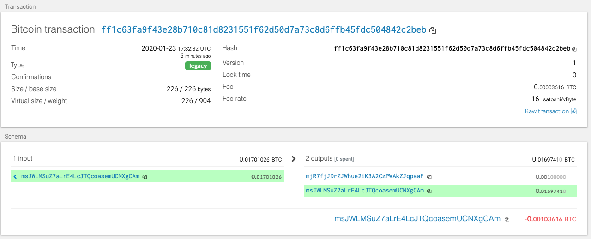
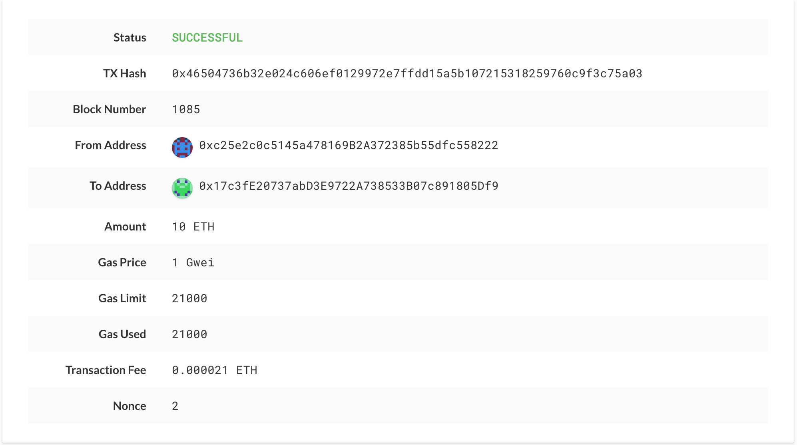

# hw19_hd_wallet

```from wallet import *```
```account_one = priv_key_to_account(BTCTEST, coins[BTCTEST][0]['privkey'])```
```send_tx(BTCTEST, account_one, coins[BTCTEST][1]['address'], 0.001)```

```account_two = priv_key_to_account(ETH, '0x861e6997246078501774cb255157cd3bf8bc21c4d9aa510e3dcdfd674a2f6b17')```
```send_tx(ETH, account_two, coins[ETH][1]['address'], 10000000000000000000)```

